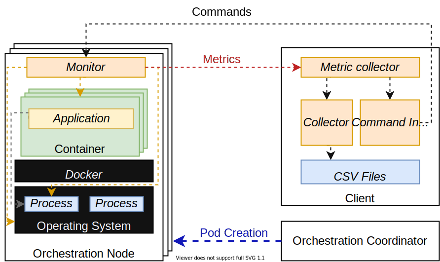

# kubemon
A tool for distributed container monitoring over Kubernetes.

## Table of contents
- [Environment requirements](#environment-requirements)
- [Application requirements](#application-requirements)
- [Illustrations](#illustrations)
- [Main functionalities](#main-functionalities)
- [Installation](#installation)
- [Running](#running)
    - [Collector](#collector)
    - [Monitor](#monitor)
    - [CLI](#cli)
- [References](#references)

## Environment requirements
- Ubuntu 18.04
- Kubernetes v1.19
- Docker v.19.03.13
- Python 3.8
- make

## Application requirements
- [psutil](https://github.com/giampaolo/psutil)
- [requests](https://github.com/psf/requests)
- [addict](https://github.com/mewwts/addict)
- [docker-py](https://github.com/docker/docker-py)
- [sty](https://github.com/feluxe/sty)
- [virtualenv](https://github.com/pypa/virtualenv)

## Illustrations
Basic diagram


## Main functionalities
- Collects metrics from operating system, Docker containers and processes created by the container
- Send the collected metrics to the ```collector``` object, which saves the data in a CSV file
- Can be controlled by a basic CLI

## Installation
1. Create a virtual environment and activate it
    ```sh
    $ python3 -m venv venv 
    $ source venv/bin/activate
    ```
2. Install packages
    ```sh 
    (venv) $ pip install .
    ```

## Running
In the further subsections will be teaching how to execute this tool.

A brief command list:
```sh
usage: kubemon.py [-h] [-l] [-t TYPE] [-H IP] [-p PORT] [-f FILE1 FILE2] [-c [COMMAND ...]] [-i INTERVAL]

Kubemon commands

optional arguments:
  -h, --help            show this help message and exit
  -l, --list            Lists all available modules
  -t TYPE, --type TYPE  Functionality of sys-monitor. E.g. collector, monitor, merge...
  -H IP, --host IP      Host that any of sys-monitor functions will be connecting
  -p PORT, --port PORT  Port of the host
  -f FILE1 FILE2, --files FILE1 FILE2
                        Files for merge
  -c [COMMAND ...], --command [COMMAND ...]
                        Command for be executing on CollectorClient
  -i INTERVAL, --interval INTERVAL
                        Data collection rate by monitors
```
### Collector
```sh
(venv) $ make collector
[ Collector ] Started collector CLI at 0.0.0.0:9880
[ Collector ] Started collector at 0.0.0.0:9822
```

### Monitor
Assuming that the collector IP is ```192.168.0.3```, let's connect the monitors to it.

There are three types of monitors:
1. OSMonitor - Collects Operating System metrics
2. DockerMonitor - Collects Docker metrics
3. ProcessMonitor - Collects container processes metrics

**The tool must be executed as ```sudo``` because some metrics (e.g. network, disk, ...) are available only for super users.**

In this case, let's run all the monitors at once:
```sh
(venv) $ sudo python main.py -t all -H 192.168.0.3
Connected OSMonitor_192_168_0_3_node_0 monitor to collector
...
```
### CLI
Assuming the same IP address for the collector in the section [Monitor](#monitor), the port to communicate with the ```collector``` via CLI is ```9880```.

There are two commands available so far:
1. ```/instances``` - Number of monitor instances connected to the ```collector``` object.
2. ```/start <output_dir>``` - Start the monitors and setting up the output directory to save the files
```sh
(venv) $ python main.py -t cli -p 192.168.0.3 -c /instances
Connected instances: 0
```
## References
- [Block layer statistics](https://www.kernel.org/doc/html/latest/block/stat.html)
- [/proc virtual file system](https://man7.org/linux/man-pages/man5/proc.5.html)
- [Evaluation of desktop operating systems under thrashing conditions](https://journal-bcs.springeropen.com/track/pdf/10.1007/s13173-012-0080-8.pdf)
- [cgroups](https://www.man7.org/linux/man-pages/man7/cgroups.7.html)
- [Docker runtime metrics](https://docs.docker.com/config/containers/runmetrics/)
