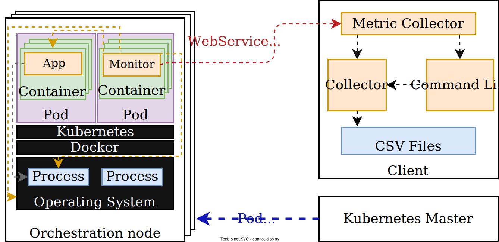

# kubemon
A tool for distributed container monitoring over Kubernetes.

## Translations
- [Português](./assets/README-pt-br.md)

## Table of contents
- [Environment Requirements](#environment-requirements)
- [Application Requirements](#application-requirements)
- [Illustrations](#illustrations)
- [Main Functionalities](#main-functionalities)
    - [Collected Metrics](#collected-metrics)
- [Installation](#installation)
- [Configuration](#configuration)
- [Running](#running)
    - [Starting](#starting)
    - [Stopping](#stopping)
    - [Commands](#all-the-cli-commands)
- [References](#references)

## Environment requirements
- Ubuntu 18.04
- Kubernetes v1.19
- Docker v19.03.13
- Python 3.8
- GNU Make 4.2.1

## Application requirements
- [psutil](https://github.com/giampaolo/psutil)
- [requests](https://github.com/psf/requests)
- [docker-py](https://github.com/docker/docker-py)
- [virtualenv](https://github.com/pypa/virtualenv)
- [flask](https://github.com/pallets/flask)
- [flask_restfull](https://github.com/flask-restful/flask-restful)
- [gunicorn](https://github.com/benoitc/gunicorn)

## Illustrations
Basic diagram


## Main functionalities
- Collect data within the provider domain
- The data are collected within Kubernetes Pods
- Can be configured through Kubernetes environment variables
- Collects metrics from operating system, Docker containers and processes created by the container
- Send the collected metrics to the ```collector``` module, which saves the data in a CSV file
- Can be controlled remotely by either a basic CLI or Python API

### Collected metrics
For more information about the collected metrics, please refer to:
- Operating System Metrics: These metrics are collected from linux ```/proc``` filesystem using both ```psutil``` Python API and ```/sys/block/<dev>/stat```.
    - CPU: [Miscellaneous kernel statistics in /proc/stat](https://www.kernel.org/doc/html/latest/filesystems/proc.html#miscellaneous-kernel-statistics-in-proc-stat)
    - Memory: [proc - process information pseudo-filesystem: /proc/vmstat](https://man7.org/linux/man-pages/man5/proc.5.html)
    - Disk : [Block layer statistics in /sys/block/\<dev\>/stat](https://www.kernel.org/doc/html/latest/block/stat.html#block-layer-statistics-in-sys-block-dev-stat)
    - Network: [proc - process information pseudo-filesystem: /proc/net/dev](https://man7.org/linux/man-pages/man5/proc.5.html)
- Docker: These metrics are collected from linux ```cgroups```.
    - CPU: [cgroups - Linux control groups: cpu,cpuacct](https://www.man7.org/linux/man-pages/man7/cgroups.7.html)
    - Memory: [cgroups - Linux control groups: memory](https://www.man7.org/linux/man-pages/man7/cgroups.7.html)
    - Disk: [cgroups - Linux control groups: blkio](https://www.man7.org/linux/man-pages/man7/cgroups.7.html)
    - Network: [proc - process information pseudo-filesystem: /proc/net/dev](https://man7.org/linux/man-pages/man5/proc.5.html)
- Docker Processes: These metrics are collected from linux ```/proc``` filesystem using ```psutil``` Python API.
    - CPU: [Miscellaneous kernel statistics in /proc/stat](https://www.kernel.org/doc/html/latest/filesystems/proc.html#miscellaneous-kernel-statistics-in-proc-stat)
    - Memory: [proc - process information pseudo-filesystem: /proc/vmstat](https://man7.org/linux/man-pages/man5/proc.5.html)
    - Disk: [Block layer statistics in /sys/block/\<dev\>/stat](https://www.kernel.org/doc/html/latest/block/stat.html#block-layer-statistics-in-sys-block-dev-stat)
    - Network: [proc - process information pseudo-filesystem: /proc/net/dev](https://man7.org/linux/man-pages/man5/proc.5.html)

#### **Operating System**
|  Type   |  Unit  | Metric |
| ------- | ------ | ------ |
| CPU     | Quantity <br> Quantity <br> Quantity <br> Quantity <br> Clock Ticks <br> Clock Ticks <br> Clock Ticks <br> Clock Ticks <br> Clock Ticks <br> Clock Ticks <br> Clock Ticks <br> Clock Ticks <br> Clock Ticks <br> | Context Switches <br> Interrupts <br> Soft Interrupts <br> Syscalls <br> Times User <br> Times System <br> Times Nice <br> Times Softirq <br> Times IRQ <br> Times IOWait <br> Times Guest <br> Times Guest Nice <br> Times Idle |
| Memory  | Quantity <br> Quantity <br> Quantity <br> Quantity <br> Quantity <br> KB <br> KB <br> Quantity <br> Quantity <br> Quantity <br> Quantity <br> | Active (Anon) <br> Inactive (Anon) <br> Inactive (file) <br> Active (file) <br> Mapped Pages <br> KB Paged In Since Boot (pgpgin) <br> KB Paged Out Since Boot (pgpgout) <br> Pages Free (pgfree) <br> Page Faults (pgfault) <br> Major Page Faults (pgmajfault) <br> Pages Reused (pgreuse) |
| Disk    | Requests <br> Requests <br> Sectors <br> Milliseconds <br> Requests <br> Requests <br> Sectors <br> Milliseconds <br> Requests <br> Milliseconds <br> Milliseconds <br> Requests <br> Requests <br> Sectors <br> Milliseconds <br> Requests <br> Milliseconds | Read I/O <br> Read I/O Merged with In-queue I/O <br> Read Sectors <br> Total Wait Time for Read Requests <br> Write I/O <br> Write I/O Merged with In-Queue I/O <br> Write Sectors <br> Total Wait Time for Write Requests <br> I/O in Flight <br> Total Time This Block Device Has Been Active <br> Total Wait Time for All Requests <br> Discard I/O Processed  <br> Discard I/O Processed with In-Queue I/O <br> Discard Sectors <br> Total Wait Time for Discard Requests <br> Flush I/O Processed <br> Total Wait Time for Flush Requests |
| Network | Bytes <br> Bytes <br> Packets <br> Packets | Sent <br> Received <br> Sent <br> Received |

#### **Docker Processes**
|  Type   |  Unit  | Metric |
| ------- | ------ | ------ |
| CPU     | Clock Ticks <br> Clock Ticks <br> Clock Ticks <br> Clock Ticks <br> Clock Ticks <br> | User Time <br> System Time <br> Children User <br> Children System <br> IOWait |
| Memory  | Pages <br> Pages <br> Pages <br> Pages <br> Pages <br> Pages <br> Pages <br> | Total Program Size (size) <br> Resident Set Size (resident) <br> Resident Shared Pages (shared) <br> Text (text) <br> ~~Library (lib)~~ <br> Data + Stack (data) <br> ~~Dirty Pages (dt)~~ |
| Disk    | Requests <br> Requests <br> Bytes <br> Bytes <br> Chars <br> Chars <br> | Read <br> Write <br> Read <br> Write <br> Read <br> Write <br> |
| Network | Bytes <br> Bytes <br> Packets <br> Packets | Sent <br> Received <br> Sent <br> Received |

#### **Docker**
|  Type   |  Unit  | Metric |
| ------- | ------ | ------ |
| CPU     | Clock Ticks <br> Clock Ticks <br> Quantity <br> Quantity <br> Clock Ticks <br> | User <br> System <br> Periods <br> Throttled <br> Throttled Time <br> |
| Memory  | Pages <br> Pages <br> Pages <br> Pages <br> Pages <br> Pages <br> Pages <br> Pages <br> Pages <br> Pages <br> Pages <br> Pages <br> | Resident Set Size (rss) <br> Chached <br> Mapped (mapped_file) <br> Paged In (pgpgin) <br> Paged Out (pgpgout) <br> Page Faults (pgfault) <br> Major Page Faults (pgmajfault) <br> Active (active_anon) <br> Inactive (inactive_anon) <br> Active File (active_file)<br> Inactive File (inactive_file) <br> Unevictable <br> |
| Disk    | Bytes <br> Bytes <br> Bytes <br> Bytes <br> Bytes <br> Bytes <br> | Read <br> Write <br> Sync <br> Async <br> Discard <br> Total <br> |
| Network | Bytes <br> Bytes <br> Packets <br> Packets | Sent <br> Received <br> Sent <br> Received |

## Installation
Before installing Kubemon, make sure Kubernetes and Docker are properly installed in the system.

1. Download the latest version here: [kubemon](https://github.com/hrchlhck/kubemon/zipball/main) 

2. Extract the zip file and go on the extracted directory

3. Update the ```nodeName``` field in ```kubernetes/04_collector.yaml``` to your the name of your Kubernetes control-plane node.

4. Apply the Kubernetes objects within ```kubernetes/```:
    ```sh
    $ kubectl apply -f kubernetes/
    namespace/kubemon created
    configmap/kubemon-env created
    persistentvolume/kubemon-volume created
    persistentvolumeclaim/kubemon-volume-claim created
    service/collector created
    service/monitor created
    pod/collector created
    daemonset.apps/kubemon-monitor created
    ```

The following subsection will detail about how to configure and execute the data collecting process.

## Configuration
Kubemon has a few variables that can be defined by the user. For instance, some of the required fields to be configured before running the tool is ```NUM_DAEMONS```, which denotes the expected amount of ```client``` instances should be connected to the ```collector``` component. In addition, the Kubemon components are configured through environment variables inside the Kubernetes pods.

The configuration file is at ```kubernetes/01_configmap.yaml```. At the current version of Kubemon, the configmap lists all the configurable variables. You can update according to your needs.

The collected metrics will be saved in the Kubernetes control-plane node by default, in ```/mnt/kubemon-data```. This setting can be changed in ```./kubernetes/02_volumes.yaml``` by updating the ```hostPath``` field. 

Example: 
```yaml
# Before
...
hostPath:
    path: "/mnt/kubemon-data"
    
# After
...
hostPath:
    path: "/home/user/data"
```

## Running
### Starting
To start the collecting process, you can either start the CLI or execute commands within Python. 

Example with the CLI:
```sh
$ make cli host=10.0.1.2
Waiting for collector to be alive
Collector is alive!
>>> start test000
Starting 2 daemons and saving data at 10.0.1.2:/home/kubemon/output/data/test000
```

Example by using the CLI API within Python:
```python
>>> from kubemon.collector import CollectorClient
>>> from kubemon.settings import CLI_PORT
>>> 
>>> cc = CollectorClient('10.0.1.2', CLI_PORT)
>>> cc.start('test000')
Starting 2 daemons and saving data at 10.0.1.2:/home/kubemon/output/data/test000
```

### Stopping

Within the CLI:
```sh
>>> stop
Stopped collector
```

Using the API:
```python
...
>>> cc.stop()
Stopped collector
```

### All the CLI commands:
You can retrieve all the implemented commands by either typing ```help``` within the CLI prompt or by running ```.help()``` method from the API.

All the commands:
```
'start': Start collecting metrics from all connected daemons in the collector.

    Args:
        - Directory name to be saving the data collected. Ex.: start test000
    
'instances': Lists all the connected monitor instances.
    
'daemons': Lists all the daemons (hosts) connected.
    
'stop': Stop all monitors if they're running.
    
'help': Lists all the available commands.
    
'alive': Tells if the collector is alive.
```

## References
- [Block layer statistics](https://www.kernel.org/doc/html/latest/block/stat.html)
- [/proc virtual file system](https://man7.org/linux/man-pages/man5/proc.5.html)
- [Evaluation of desktop operating systems under thrashing conditions](https://journal-bcs.springeropen.com/track/pdf/10.1007/s13173-012-0080-8.pdf)
- [cgroups](https://www.man7.org/linux/man-pages/man7/cgroups.7.html)
- [Docker runtime metrics](https://docs.docker.com/config/containers/runmetrics/)
