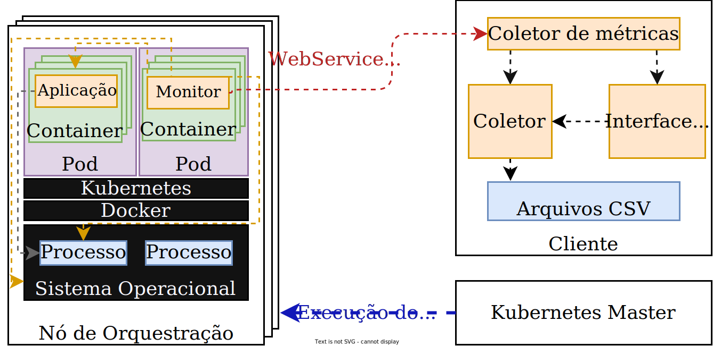

# kubemon
Uma ferramenta para monitoramento de containers distribuídos no Kubernetes.

## Sumário
- [Dependências de Ambiente](#dependencias-de-ambiente)
- [Dependências de Aplicação](#dependencias-de-aplicaçao)
- [Diagramas](#diagramas)
- [Principais Funcionalidades](#principais-funcionalidades)
- [Instalação](#instalaçao)
- [Executando](#executando)
    - [Collector](#collector)
    - [Monitor](#monitor)
    - [CLI](#cli)
- [Referências](#referencias)

## Dependências de Ambiente
- Ubuntu 18.04
- Kubernetes v1.19
- Docker v.19.03.13
- Python 3.8
- make

## Dependências de Aplicação
- [psutil](https://github.com/giampaolo/psutil)
- [requests](https://github.com/psf/requests)
- [addict](https://github.com/mewwts/addict)
- [docker-py](https://github.com/docker/docker-py)
- [sty](https://github.com/feluxe/sty)
- [virtualenv](https://github.com/pypa/virtualenv)

## Diagramas
Diagrama simples da ferramenta. 


## Principais Funcionalidades
- Coleta métricas de sistema operacional, containers Docker e processos criados pelos containers
- Envia as métricas coletadas para o módulo ```collector```, que salva em um arquivo CSV
- Pode ser controlada remotamente por uma CLI básica

## Instalação
1. Crie um ambiente virtual do Python e ative-o
    ```sh
    $ python3 -m venv venv 
    $ source venv/bin/activate
    ```
2. Instale as dependências
    ```sh 
    (venv) $ pip install .
    ```

## Running
Nas próximas seções será abordado como executar cada módulo da ferramenta.

Lista de comandos disponíveis:
```sh
usage: kubemon.py [-h] [-l] [-t TYPE] [-H IP] [-p PORT] [-f FILE1 FILE2] [-c [COMMAND ...]] [-i INTERVAL]

Kubemon commands

optional arguments:
  -h, --help            show this help message and exit
  -l, --list            Lista os módulos existentes
  -t TYPE, --type TYPE  Funcionalidade do Kubemon. E.g. collector, monitor, docker...
  -H IP, --host IP      Endereço IP do módulo collector executando
  -p PORT, --port PORT  Porta do módulo collector (por padrão é 9822)
  -f FILE1 FILE2, --files FILE1 FILE2 Arquivos para juntar
  -c [COMMAND ...], --command [COMMAND ...]
                        Comando para ser executado pelo módulo CollectorClient
  -i INTERVAL, --interval INTERVAL
                        Janela de tempo para coleta de dados (por padrão é 5)
```
### Collector
```sh
(venv) $ make collector
[ Collector ] Started collector CLI at 0.0.0.0:9880
[ Collector ] Started collector at 0.0.0.0:9822
```

### Monitor
Assuming that the collector IP is ```192.168.0.3```, let's connect the monitors to it.

Assumindo que o IP do módulo ```collector``` é ```192.168.0.3```, podemos conectar os monitores com os comandos a seguir.

Existem três tipos de monitores:
1. OSMonitor - Coleta métricas de Sistema Operacional
2. DockerMonitor - Coleta métricas de containers Docker
3. ProcessMonitor - Coleta métricas de processos criados por containers

**A ferramenta deve ser executada com ```sudo```, porque algumas métricas estão disponíveis somente para usuários privilegiados.**

Neste caso, para executar os três monitores:
```sh
(venv) $ sudo python main.py -t all -H 192.168.0.3
Connected OSMonitor_192_168_0_3_node_0 monitor to collector
...
```
### CLI
Assumindo o mesmo IP na seção [Monitor](#monitor), a porta para comunicação com o ```collector``` via CLI é ```9880```.

Até o momento existem os comandos:
1. ```/instances``` - Quantidade de instâncias ```monitor``` conectadas ao módulo ```collector```.
2. ```/start <output_dir>``` - Inicia a coleta de métricas e salva no diretório ```output_dir``` definido pelo usuário.
```sh
(venv) $ python main.py -t cli -p 192.168.0.3 -c /instances
Connected instances: 0
```
## Referências
- [Block layer statistics](https://www.kernel.org/doc/html/latest/block/stat.html)
- [/proc virtual file system](https://man7.org/linux/man-pages/man5/proc.5.html)
- [Evaluation of desktop operating systems under thrashing conditions](https://journal-bcs.springeropen.com/track/pdf/10.1007/s13173-012-0080-8.pdf)
- [cgroups](https://www.man7.org/linux/man-pages/man7/cgroups.7.html)
- [Docker runtime metrics](https://docs.docker.com/config/containers/runmetrics/)
